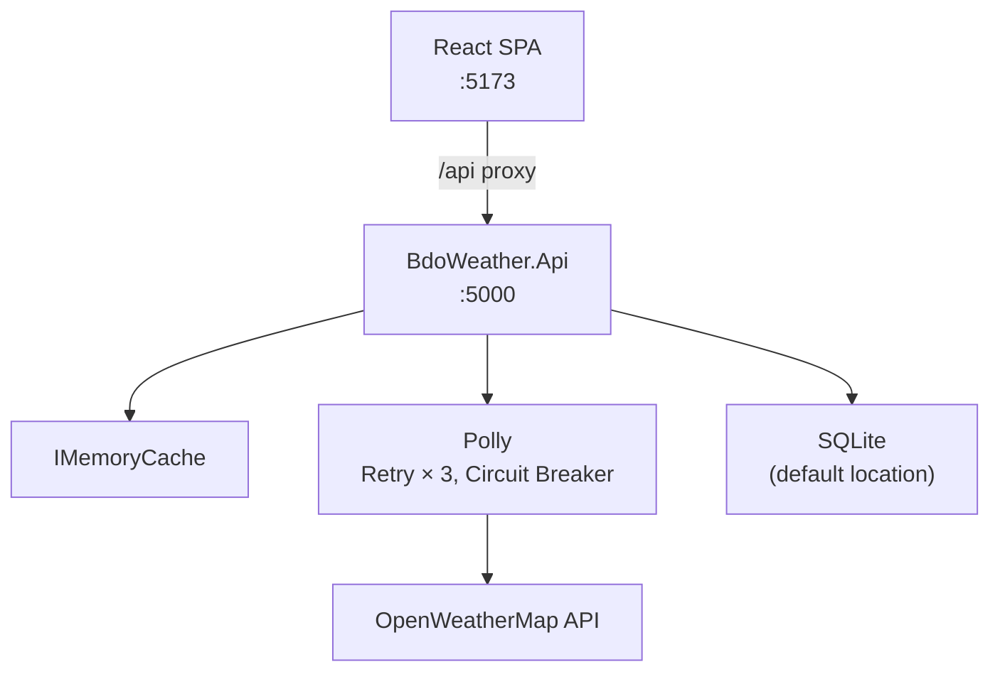

# BDO Weather

A full-stack weather dashboard.  
**Back-end:** .NET 10 / C# 14 / ASP.NET Core Minimal API  
**Front-end:** React (JavaScript) / Vite 8 / Tailwind CSS v4

---

## Prerequisites

| Tool | Version |
|---|---|
| .NET SDK | 10.0+ |
| Node.js | 22+ |
| OpenWeatherMap API key | [free tier](https://openweathermap.org/api) |

---

## Quick start

### 1 — Clone

```bash
git clone https://github.com/nerdcules/bdo-weather.git
cd bdo-weather
```

### 2 — Configure the API key

```bash
# Create a local override (not committed)
cp src/BdoWeather.Api/appsettings.Development.json src/BdoWeather.Api/appsettings.Local.json
```

Edit `appsettings.Local.json`:

```json
{
  "WeatherApi": {
    "ApiKey": "YOUR_OWM_KEY_HERE",
    "UseMock": false
  }
}
```

> Without an API key, leave `UseMock: true` (the default for Development) to use deterministic mock data.

### 3 — Run the back-end

```bash
cd src/BdoWeather.Api
dotnet run
# Listening on http://localhost:5000
```

### 4 — Run the front-end

```bash
cd src/bdo-weather-ui
cp .env.example .env.local   # optional — only needed for non-default API URL
npm install
npm run dev
# http://localhost:5173
```

---

## Running tests

### Backend (TUnit)

```bash
cd src/BdoWeather.Tests
dotnet test
```

### Frontend (Vitest)

```bash
cd src/bdo-weather-ui
npm test           # run once
npm run test:ui    # interactive UI mode
```

---

## Project structure

```
bdo-weather/
├── src/
│   ├── BdoWeather.Api/          # .NET 10 Minimal API
│   │   ├── Common/              # Result<T>, ApiEnvelope, GlobalExceptionHandler
│   │   ├── Features/
│   │   │   ├── DefaultLocation/ # GET + PUT /api/default-location
│   │   │   ├── Mock/            # GET /api/weather/mock
│   │   │   └── Weather/         # GET /api/weather
│   │   ├── Infrastructure/      # WeatherApiClient, IWeatherApiClient, Polly
│   │   └── Persistence/         # EF Core + SQLite, migrations
│   ├── BdoWeather.Tests/        # TUnit + Shouldly + NSubstitute
│   └── bdo-weather-ui/          # Vite + React SPA
│       └── src/
│           ├── features/
│           │   ├── weather/     # search, display, icon, error, skeleton
│           │   └── defaultLocation/ # form, badge
│           ├── shared/          # apiClient, ErrorBoundary, Toast, format utils
│           └── stores/          # Zustand: weather, settings, toast
├── requirements/                # BE + FE specs with Mermaid diagrams
├── .tours/                      # CodeTour walkthroughs (install CodeTour extension)
└── .copilot-logs/               # Copilot interaction logs
```

---

## API endpoints

| Method | Path | Description |
|---|---|---|
| `GET` | `/api/weather?city={city}` | Current weather for a city |
| `GET` | `/api/weather/mock` | Deterministic mock response |
| `GET` | `/api/default-location` | Get saved default city |
| `PUT` | `/api/default-location` | Save default city |

All responses use the envelope shape:

```json
{ "data": { ... }, "errors": null }
{ "data": null, "errors": [{ "code": "CITY_NOT_FOUND", "message": "..." }] }
```

---

## Architecture



---

## CodeTour walkthroughs

Install the [CodeTour](https://marketplace.visualstudio.com/items?itemName=vsls-contrib.codetour) VS Code extension, then open the **CodeTour** panel to start any of the three guided tours:

1. **Architecture Overview** — repo layout, standards, entry points
2. **Backend Walkthrough** — DI wiring, feature handlers, resilience, tests
3. **Frontend Walkthrough** — component tree, React Query, Zustand, utils, tests

---

## CI

GitHub Actions runs on every push to `main` and on pull requests:

- `dotnet test` — all TUnit backend tests
- `npm test` — all Vitest frontend tests (23 tests)
