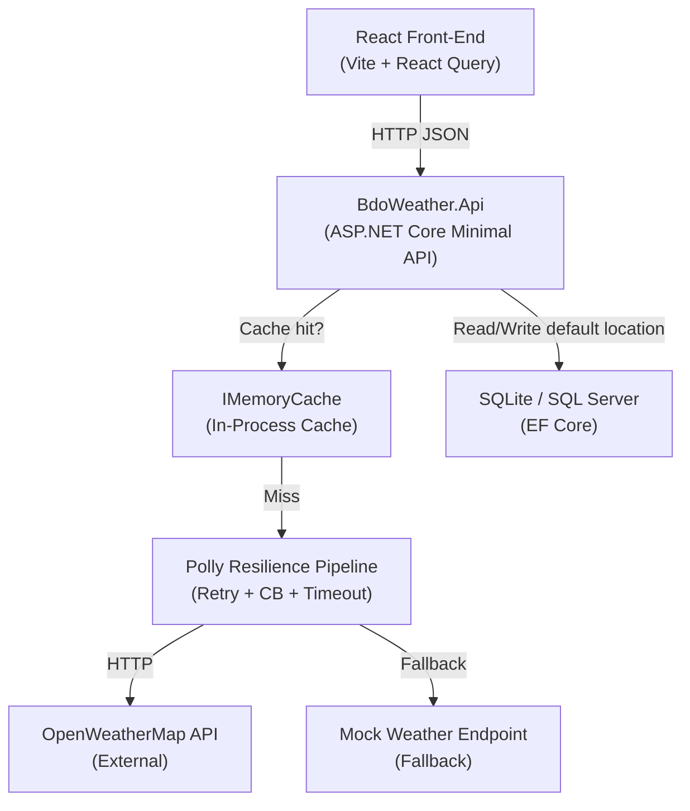
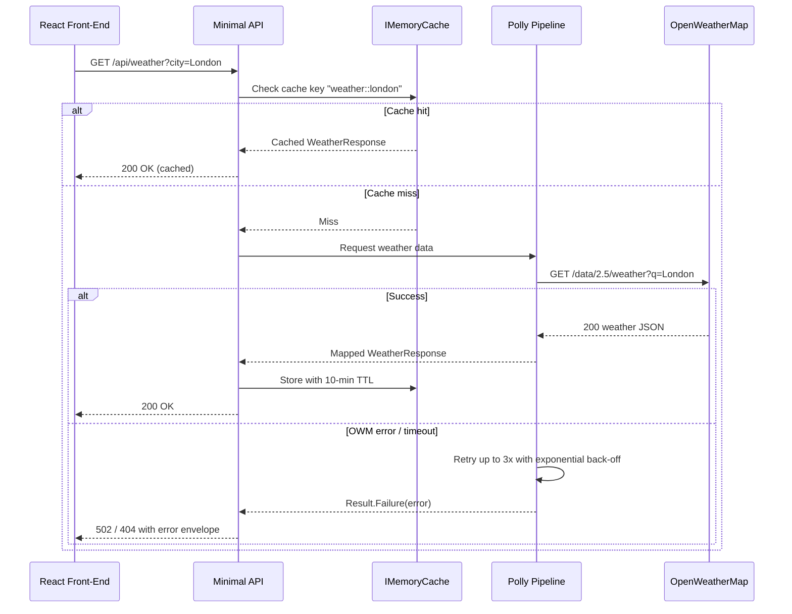
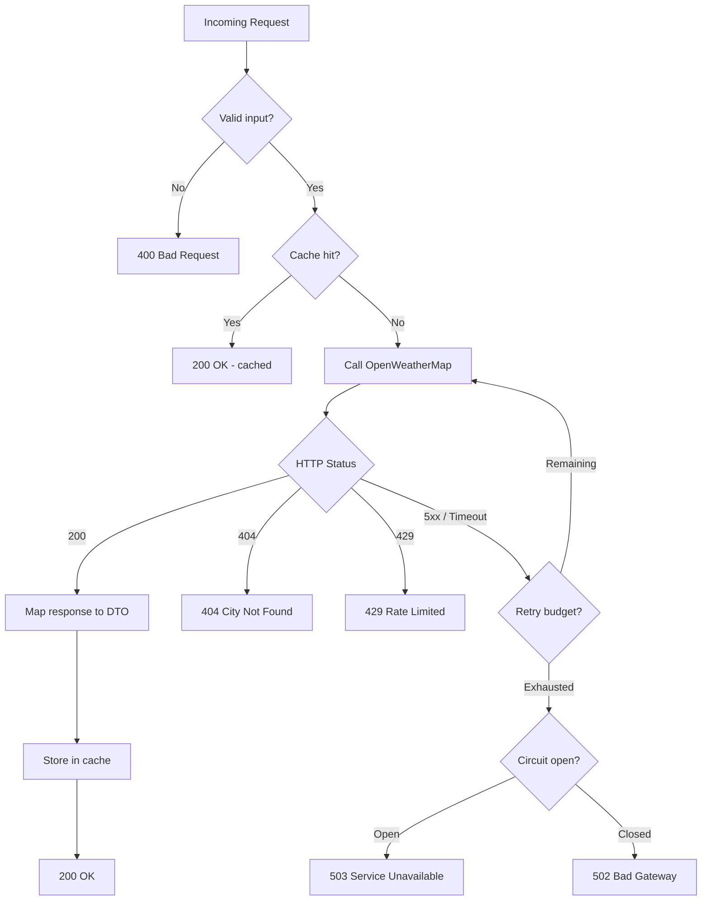
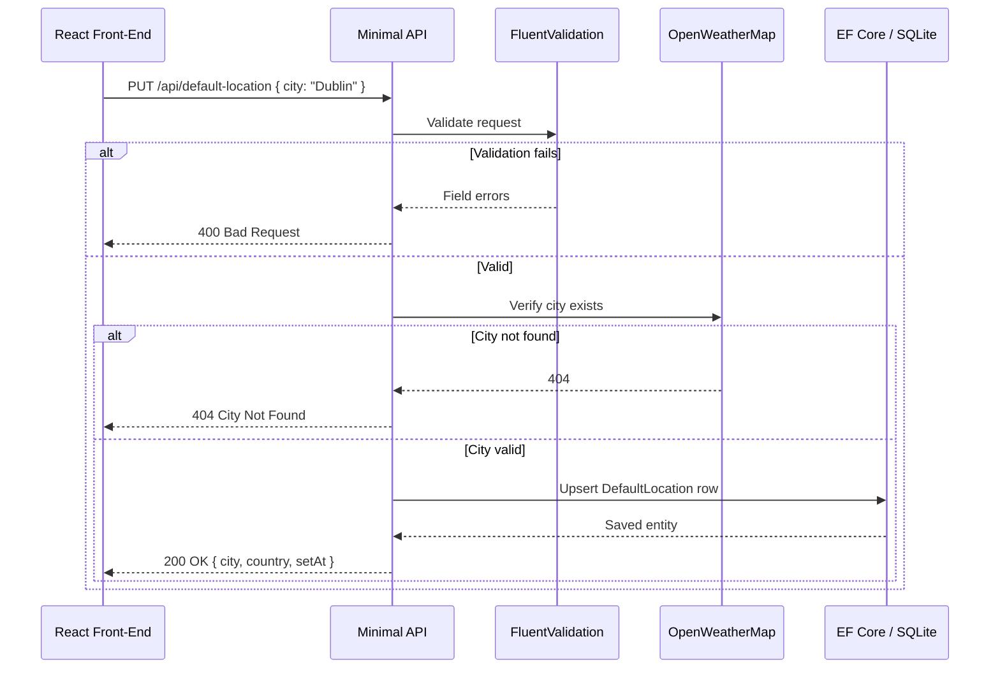
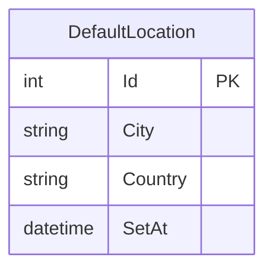
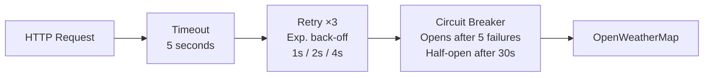

# Weather Dashboard — Back-End Requirements

## Overview
A RESTful ASP.NET Core Minimal API service (.NET 10, C# 14) acting as a proxy and enrichment
layer between the React front-end and the OpenWeatherMap API. Handles weather lookups,
default-location persistence, caching, resilience, and structured error responses.

**Design philosophy:** Simple, extensible vertical-slice architecture. Each feature is a
self-contained folder — adding a new endpoint means adding a new folder, not touching existing
code. Polly + caching sit in infrastructure and are injected, so they can be swapped without
changing feature logic.

---

## System Architecture



---

## Architecture

- Pattern: Clean Architecture with vertical slice features.
- Each feature lives in `Features/<FeatureName>/<Action>.cs`.
- DTOs defined per feature; domain models never exposed directly.
- All public contracts use C# `record` types with `init`-only properties.
- Results returned as `Result<T, TError>` — exceptions reserved for unrecoverable conditions.
- Namespace style: file-scoped (`namespace BdoWeather.Features.Weather;`).

**Why this structure?** Each vertical slice is independently readable and deletable. New
features have zero friction — create a folder, define a handler, register a route. No base
classes to extend, no registries to update.

---

## Project Structure

```
BdoWeather.Api/
  Features/
    Weather/
      GetWeatherByCity.cs
      GetWeatherByCity.Request.cs
      GetWeatherByCity.Response.cs
    DefaultLocation/
      GetDefaultLocation.cs
      SetDefaultLocation.cs
      DefaultLocation.Request.cs
      DefaultLocation.Response.cs
    Mock/
      GetMockWeather.cs          # Fallback when OWM unavailable
  Infrastructure/
    WeatherApiClient.cs          # Polly-wrapped HttpClient
    WeatherApiOptions.cs
    CacheKeys.cs
  Persistence/
    AppDbContext.cs
    DefaultLocationEntity.cs
    DefaultLocationConfiguration.cs
  Common/
    ResultTypes.cs               # Result<T, TError>, Error record
    ProblemDetailsExtensions.cs
  Program.cs
  appsettings.json
  appsettings.Development.json

BdoWeather.Tests/
  Features/
    Weather/GetWeatherByCityTests.cs
    DefaultLocation/SetDefaultLocationTests.cs
    DefaultLocation/GetDefaultLocationTests.cs
  Infrastructure/
    WeatherApiClientTests.cs
```

---

## Request Flow



---

## Error Handling Flow



---

## Default Location Flow



---

## Domain Model



---

## Resilience Pipeline



Register via `services.AddHttpClient<WeatherApiClient>().AddResiliencePipeline(...)`.

---

## API Endpoints

### GET `/api/weather?city={cityName}`

**Request**
| Parameter | Type | Required | Description |
|---|---|---|---|
| city | string | Yes | City name to look up |

**Success Response — 200 OK**
```json
{
  "data": {
    "city": "London",
    "country": "GB",
    "temperature": { "current": 14.2, "feelsLike": 12.8, "min": 11.0, "max": 16.5, "unit": "celsius" },
    "humidity": 78,
    "windSpeed": 5.3,
    "windDirection": 220,
    "description": "overcast clouds",
    "icon": "04d",
    "iconUrl": "https://openweathermap.org/img/wn/04d@2x.png",
    "sunrise": "2026-03-12T06:14:00Z",
    "sunset": "2026-03-12T18:22:00Z",
    "fetchedAt": "2026-03-12T18:45:00Z"
  },
  "errors": []
}
```

**Error Responses**
| Status | Scenario |
|---|---|
| 400 | `city` missing or empty |
| 404 | City not found by OWM |
| 502 | OWM unreachable |
| 429 | OWM rate limit hit |
| 500 | Unhandled server error |

All errors use the standard envelope:
```json
{ "data": null, "errors": [{ "code": "CITY_NOT_FOUND", "message": "No city found matching 'Lodnon'." }] }
```

### GET `/api/default-location`
Returns saved default or `"data": null` if none set.

### PUT `/api/default-location`
Body: `{ "city": "Dublin" }`. Validates city exists before persisting.

**Validation Rules**
- `city` non-empty, max 100 chars, no special characters beyond hyphens/spaces.
- City verified against OWM before saving.

### GET `/api/weather/mock?city={cityName}`
Returns deterministic synthetic weather data. Active when `WeatherApi:UseMock = true`.

---

## Caching (Bonus — Implemented)
- `IMemoryCache` keyed `weather::{city_lowercase}`.
- TTL: 10 min (weather), 24 h (default location).
- Bypassed on error responses.
- Cache hit/miss logged at `Information` level.

---

## Persistence
- EF Core with SQLite (dev) / SQL Server (prod) via connection string.
- Entities configured via `IEntityTypeConfiguration<T>`.
- All reads use `AsNoTracking()`.

---

## Validation
- FluentValidation on all request models.
- Registered via `services.AddValidatorsFromAssemblyContaining<Program>()`.
- Returns 400 with field-level error details.

---

## Error Handling
- Global `IExceptionHandler` middleware catches unhandled exceptions.
- Stack traces never exposed in production.
- All expected failures return `Result<T, Error>` — no `throw` for business-rule paths.

---

## Logging
- Structured logging via `ILogger<T>`.
- Log: city searched, cache hit/miss, upstream API latency, Polly retry/circuit events.
- Levels: `Information` (normal), `Warning` (retries), `Error` (upstream failures).
- API keys never logged.

---

## Security
- API key via `WEATHER_API_KEY` env var or `appsettings.Development.json` (gitignored).
- CORS restricted to `ALLOWED_ORIGINS`.
- Rate limiting: 60 req/min per IP on `/api/weather`.

---

## Configuration
```json
{
  "WeatherApi": {
    "BaseUrl": "https://api.openweathermap.org/data/2.5",
    "ApiKey": "",
    "TimeoutSeconds": 5,
    "CacheTtlMinutes": 10,
    "UseMock": false
  },
  "AllowedOrigins": ["http://localhost:5173"],
  "ConnectionStrings": { "Default": "Data Source=bdo-weather.db" }
}
```

---

## Tests — TUnit + Shouldly + NSubstitute

| Area | Type | Scenarios |
|---|---|---|
| `GetWeatherByCity` | Unit | Valid city, not found, upstream error, cache hit |
| `SetDefaultLocation` | Unit | Valid, invalid input, city validation failure |
| `GetDefaultLocation` | Unit | Returns saved, null when none set |
| `WeatherApiClient` | Unit | Maps OWM response, 404, timeout |
| Weather endpoint | Integration | Full round-trip via `WebApplicationFactory` |
| Default location | Integration | PUT then GET round-trip |
| Polly pipeline | Unit | Retry fires N times, circuit opens at threshold |

---

## Non-Functional
- Cold start < 2s in development.
- P95 < 300ms (cache hit) / < 2s (cache miss).
- All responses `Content-Type: application/json`.
- Path `/api/v1/` reserved for future versioning.
