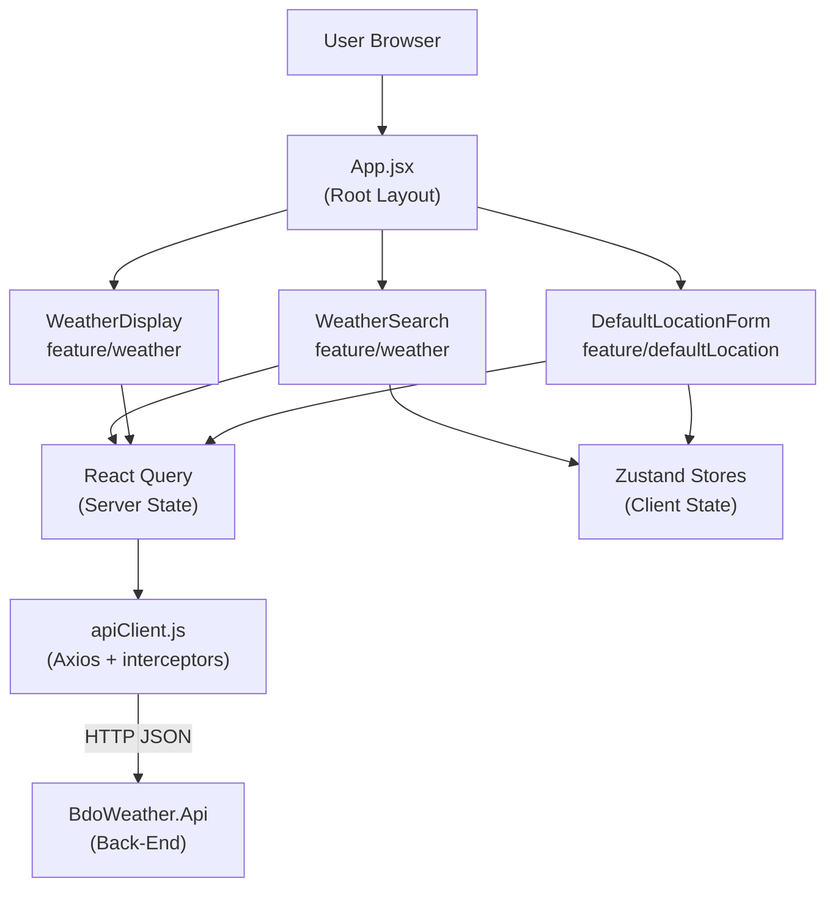
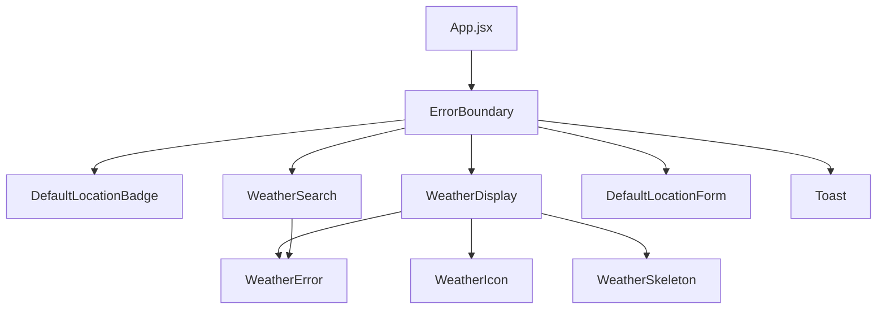
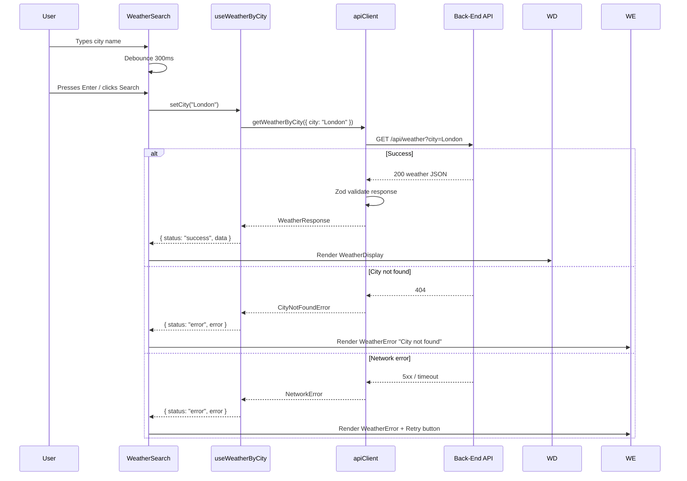
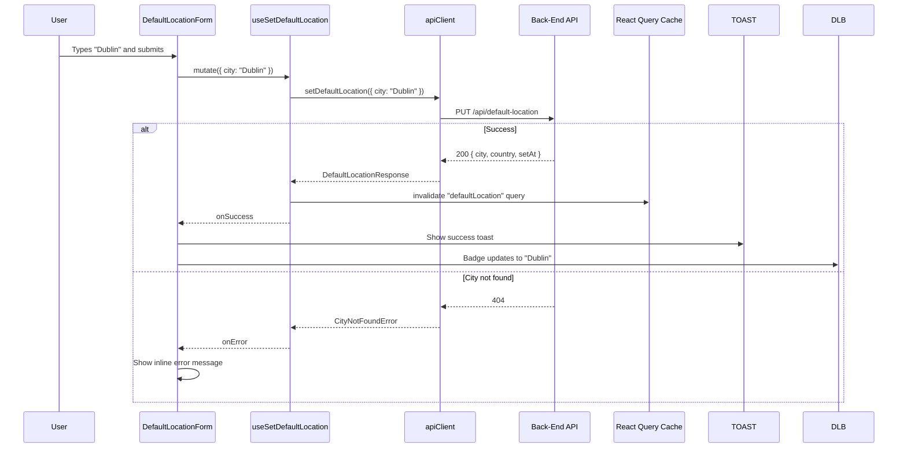
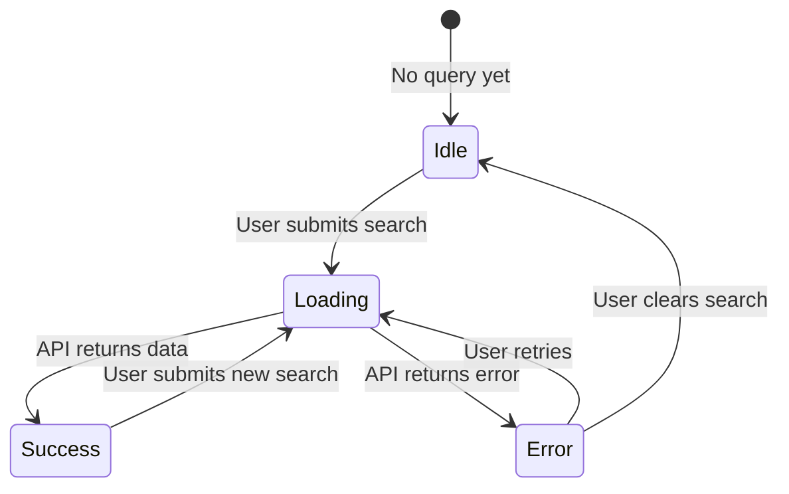
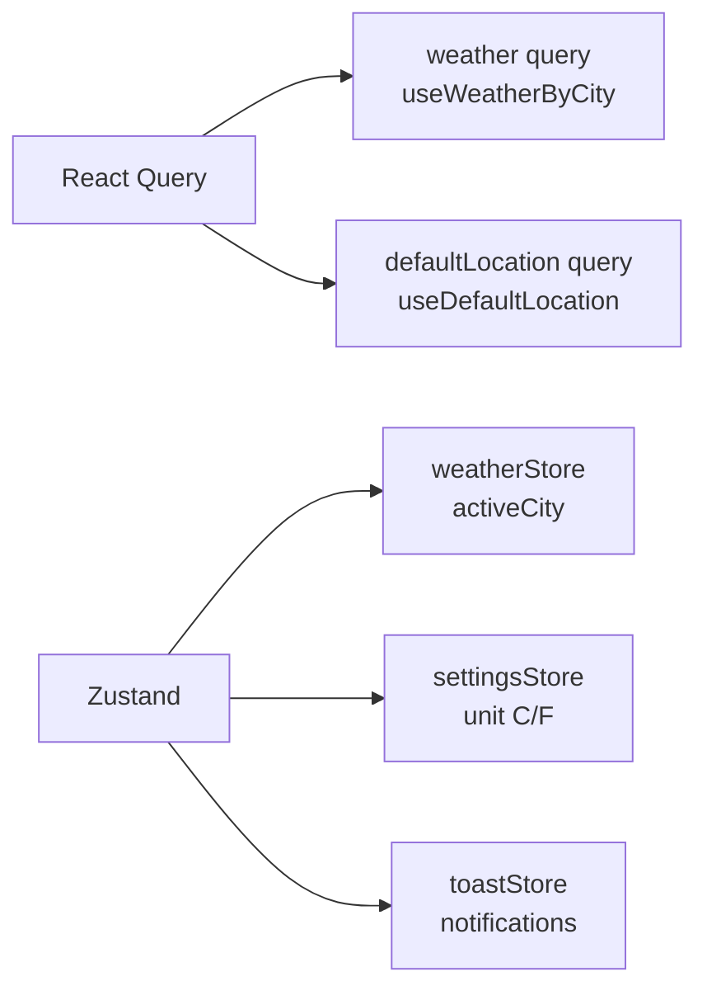

# Weather Dashboard — Front-End Requirements

## Overview
A React (JavaScript) SPA built with Vite. Real-time weather display for any city, fully
responsive, WCAG 2.1 AA compliant. Functional + immutable-first throughout, driven by React
Query and custom hooks.

**Design philosophy:** Feature folders are fully self-contained — each has its own API module,
hooks, and components. Adding a new feature means adding a folder, not editing shared
infrastructure. Zod validates at the API boundary so the rest of the app works with trusted,
shaped data.

---

## System Architecture



---

## Component Architecture



---

## Project Structure

```
src/
  features/
    weather/
      api/getWeatherByCity.js
      hooks/useWeatherByCity.js
      components/
        WeatherSearch.jsx
        WeatherDisplay.jsx
        WeatherIcon.jsx
        WeatherError.jsx
        WeatherSkeleton.jsx
    defaultLocation/
      api/getDefaultLocation.js
      api/setDefaultLocation.js
      hooks/useDefaultLocation.js
      hooks/useSetDefaultLocation.js
      components/
        DefaultLocationForm.jsx
        DefaultLocationBadge.jsx
  shared/
    components/ErrorBoundary.jsx
    components/Toast.jsx
    hooks/useDebounce.js
    utils/formatTemperature.js
    utils/formatWindSpeed.js
    utils/formatTime.js
    api/apiClient.js
  App.jsx
  main.jsx
```

---

## Weather Search Flow



---

## Default Location Flow



---

## WeatherDisplay State Machine



---

## State Management



| State | Tool | Store / Query Key |
|---|---|---|
| Weather query result | React Query | `["weather", city]` |
| Default location | React Query | `["defaultLocation"]` |
| Active displayed city | Zustand | `weatherStore.activeCity` |
| Unit preference °C/°F | Zustand | `settingsStore.unit` |
| Toast notifications | Zustand | `toastStore.toasts` |

All Zustand stores use immutable update patterns — return new state, never mutate in place.

---

## API Integration

### `apiClient.js`
- Axios instance, `baseURL` from `VITE_API_BASE_URL`.
- Request interceptor: sets `Content-Type: application/json`.
- Response interceptor: unwraps `data` envelope; throws typed errors on error envelope.

### Feature API modules
1. Axios call → 2. Zod schema validation → 3. Return validated payload or throw typed error.

Exported error types: `CityNotFoundError`, `NetworkError`, `UnexpectedApiError`.

---

## Component Specifications

### `WeatherSearch`
- Debounced input (300ms); Enter key or button click submits.
- Empty input rejected with inline validation; no API call made.
- Loading spinner inside button while query is in-flight.
- `<label>` associated with input; `aria-label="Search for weather"` on button.
- Error rendered by `<WeatherError>` with `role="alert"`.

### `WeatherDisplay`
| Field | Format |
|---|---|
| City | `London, GB` |
| Temperature | `14 °C` with °C/°F unit toggle |
| Feels Like | `Feels like 12 °C` |
| Min / Max | `↓ 11 °C  ↑ 16 °C` |
| Humidity | `78 %` |
| Wind Speed | `5.3 m/s` |
| Wind Direction | Compass bearing e.g. `SW` |
| Description | `Overcast clouds` |
| Weather Icon | `` with descriptive alt text |
| Sunrise / Sunset | Formatted local time |
| Last Updated | `Updated at 18:45` |

States: `idle` → `loading` → `success` / `error` (see state machine above).

### `WeatherIcon`
- `alt` derived from weather description e.g. `alt="Overcast clouds"`.
- Falls back to inline SVG placeholder on `onError`.

### `WeatherSkeleton`
- Layout-matched `animate-pulse` placeholders.
- `aria-busy="true"` and `aria-label="Loading weather data"`.

### `WeatherError`
- Distinguishes: city not found / network error / unexpected error.
- Network errors include a **Retry** button.
- `role="alert"` for screen reader announcement.

### `DefaultLocationForm`
- Pre-filled with current default city.
- Submit button disabled while mutation is in-flight.
- `role="status"` on success; `role="alert"` on error.

### `DefaultLocationBadge`
- Shows active default city in the header.
- Clicking re-fetches weather for that city.
- Renders nothing (no layout shift) if no default is set.

---

## Error Handling
| Trigger | UX Treatment |
|---|---|
| Empty search | Inline field validation |
| City not found | `<WeatherError>` "City not found" |
| Network / 5xx | `<WeatherError>` with Retry button |
| Unhandled exception | `<ErrorBoundary>` fallback UI |

Raw API error objects are never shown to users.

---

## Responsive Design
- Breakpoints: mobile (< 640px), tablet (640–1024px), desktop (> 1024px).
- Single column on mobile; two-column on tablet+.
- Search bar full-width at all breakpoints.
- Weather card readable without horizontal scroll at 320px.
- Touch targets ≥ 44×44px.
- Tested at: 320px, 375px, 768px, 1024px, 1440px.

---

## Accessibility (WCAG 2.1 AA)
- All interactive elements keyboard-navigable; visible `focus-visible:ring`.
- Contrast ≥ 4.5:1 (text), ≥ 3:1 (UI components/icons).
- All `` have descriptive `alt`; decorative images use `alt=""`.
- Loading states: `aria-busy` / `aria-live` / `role="status"`.
- Error states: `role="alert"`.
- Every form input has an associated `<label>`.
- No information conveyed by colour alone.

---

## Performance
- React Query stale time: 5 minutes.
- Images: `loading="lazy"` on non-critical assets.
- Code-split by feature via dynamic `import()`.
- All API calls async; no blocking main-thread operations.

---

## Environment Variables
| Variable | Required | Description |
|---|---|---|
| `VITE_API_BASE_URL` | Yes | Back-end base URL e.g. `http://localhost:5000` |

`.env.local` (gitignored) + `.env.example` (committed, empty values).

---

## Tests — Vitest + React Testing Library

| Target | Scenarios |
|---|---|
| `WeatherSearch` | Render, debounce, submit, empty validation, loading state |
| `WeatherDisplay` | Idle, skeleton, full data render, error state |
| `WeatherIcon` | Correct alt text, fallback on image error |
| `DefaultLocationForm` | Pre-fill, success, error, disabled-while-pending |
| `useWeatherByCity` | Query states, response mapping, error handling |
| `useDefaultLocation` | Returns saved; null when none set |
| `useSetDefaultLocation` | Calls API, invalidates query, exposes error |
| `formatTemperature` | °C and °F conversion and formatting |
| `apiClient` interceptors | Unwraps data envelope; throws on error envelope |

- Mock `apiClient` with `vi.mock()` in all component tests.
- Test behaviour and rendered output — not Tailwind class names.

---

## E2E Tests — Playwright
| Scenario | Steps |
|---|---|
| Search valid city | Type → submit → weather card shows city name |
| Search invalid city | Type unknown → error message visible |
| Set default location | Save → badge updates → reload → weather auto-loads |
| Responsive layout | 375px and 1440px — assert no overflow |
| Keyboard navigation | Tab all interactive elements — assert visible focus |

---

## Non-Functional
- Dev server initial load < 1s.
- Time-to-interactive < 500ms (cache hit) / < 2s (cache miss).
- No console errors or warnings in production build.
- Lighthouse accessibility score ≥ 90.
